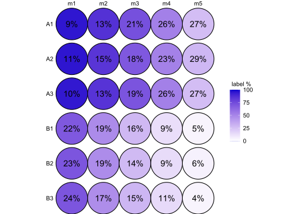

<!-- README.md is generated from README.Rmd. Please edit that file -->

# Analysis of 13C-labelled metabolomics data

<!-- badges: start -->
<!-- badges: end -->

R package for the statistical and functional analysis of 13C labelling
data.

## Installation

``` r
devtools::install_github("AlexanderKirchmair/c13ms")
```

## Introduction

Isotopologue abundances are required as a main input. The workflow is
centered around the ‘TracerExperiment’ class object, which acts as an
integrative storage of isotopologue abundances, isotopologue and
metabolite annotations, sample annotations and other metadata.

Here are some basic functionalities:

``` r
C13 <- exampleTracerExperiment(nsamples = 6, nmets = 5)

makeTracerExperiment(cbind(isoData(C13), assay(C13, "raw")), metData = metData(C13), colData = colData(C13))

colnames(C13)
metnames(C13)
rownames(C13)

colData(C13)
C13$group

C13 %>% subset(group == "A")
C13groups <- split(C13, by = ~ group)
C13 <- with(C13groups, A + B)

assay(C13, "raw")
sumMets(C13, assay = "raw")
```

Isotopologue and metabolite annotations are required to be in a specific
format:

``` r
isoData(C13)
         metabolite label
osncj_m0      osncj    m0
osncj_m1      osncj    m1
osncj_m2      osncj    m2
osncj_m3      osncj    m3
osncj_m4      osncj    m4
osncj_m5      osncj    m5
vket_m0        vket    m0
vket_m1        vket    m1
vket_m2        vket    m2
vket_m3        vket    m3
vket_m4        vket    m4
vket_m5        vket    m5
vket_m6        vket    m6
vket_m7        vket    m7
vket_m8        vket    m8
vyes_m0        vyes    m0
vyes_m1        vyes    m1
vyes_m2        vyes    m2
vyes_m3        vyes    m3
vyes_m4        vyes    m4
vyes_m5        vyes    m5
vyes_m6        vyes    m6
vyes_m7        vyes    m7
yzich_m0      yzich    m0
yzich_m1      yzich    m1
yzich_m2      yzich    m2
yzich_m3      yzich    m3
yzich_m4      yzich    m4
yzich_m5      yzich    m5
yzich_m6      yzich    m6
gjis_m0        gjis    m0
gjis_m1        gjis    m1
gjis_m2        gjis    m2
gjis_m3        gjis    m3
gjis_m4        gjis    m4
gjis_m5        gjis    m5
```

``` r
metData(C13)
            Molecule MSion
osncj     C5H30N3O12    NA
vket   C8H54N3O12P2S    NA
vyes      C7H44O17PS    NA
yzich     C6H38NO14P    NA
gjis  C5H28N2O11P2S2    NA
```

## Workflow

A typical analysis workflow may look like as demonstrated below.

Pre-processing (imputation, natural isotope abundance correction,
normalization, …):

``` r
C13 %<>% impute(assay = "raw")
C13 %<>% correctIso(assay = "imp")
C13 %<>% normalize(method = ~ COLSUM, assay = "corr")
```

Calculation of relative mass isotopomer distributions (MID), fractional
enrichment and summarization of isotopologues to metabolite levels:

``` r
assay(C13, "mid") <- MID(C13)
assay(C13, "frac", type = "met") <- isoEnrichment(C13)
assay(C13, "norm", type = "met") <- sumMets(C13)
```

Statistical testing for differences in abundances and labelling:

``` r
contrasts <- list(groupBvsA = list("group" = c("B", "A")))

C13 %<>% diffTest(contrasts = contrasts, formula = ~ group, type = "met", assay = "norm", method = "ttest")
C13 %<>% diffTest(contrasts = contrasts, formula = ~ group, type = "met", assay = "frac", method = "beta")
C13 %<>% diffTest(contrasts = contrasts, formula = ~ group, type = "iso",  assay = "mid", method = "beta")

results(C13, "iso", "mid", "beta") %>% head(10)
```

## Visualization

``` r
isoplot(C13, mets = metnames(C13)[1], cumulative = T)
```


