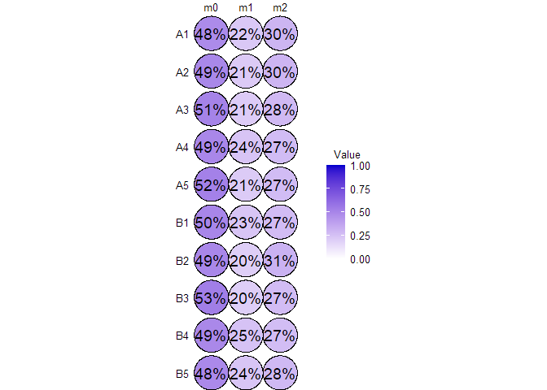

<!-- README.md is generated from README.Rmd. Please edit that file -->

# c13ms

<!-- badges: start -->
<!-- badges: end -->

Analysis of isotope-labelled metabolomics data

### Introduction

``` r
C13 <- exampleTracerExperiment(nsamples = 6, nmets = 8)

colnames(C13)
metnames(C13)
rownames(C13)

colData(C13)
C13$group

C13 %>% subset(group == "A")
C13groups <- split(C13, by = ~ group)
C13 <- with(C13groups, A + B)

metData(C13)
isoData(C13)

assay(C13, "raw")
```

## Workflow

A typical analysis workflow may look like as demonstrated below:

``` r
C13 %<>% impute(assay = "raw")
C13 %<>% correctIso()
C13 %<>% normalize(method = ~ COLSUM)
Normalization using normCOLSUM 

assay(C13, "mid") <- MID(C13)
assay(C13, "frac", type = "met") <- isoEnrichment(C13)
assay(C13, "norm", type = "met") <- sumMets(C13)

contrasts <- list(groupBvsA = list("group" = c("B", "A")))

C13 %<>% diffTest(contrasts = contrasts, formula = ~ group, type = "met", method = "limma", assay = "norm")
C13 %<>% diffTest(contrasts = contrasts, formula = ~ group, type = "met", method = "beta", assay = "frac")
C13 %<>% diffTest(contrasts = contrasts, formula = ~ group, type = "iso", method = "beta", assay = "mid")

results(C13, "iso")
$beta
$beta$groupBvsA
                 pval          diff          lfc         padj     padj_all
vem_m0   1.434480e-01  0.0000000000          NaN 1.0000000000 1.0000000000
vem_m1   3.357813e-03 -0.0233465519 -0.222513497 0.1309547044 0.1309547044
vem_m2   6.964376e-01  0.0043229810  0.048500609 1.0000000000 1.0000000000
vem_m3   4.629840e-04  0.0147981281          Inf 0.0203712945 0.0203712945
vem_m4   7.761365e-02  0.0167182054  0.189231211 1.0000000000 1.0000000000
vem_m5   9.170771e-01 -0.0012888950 -0.011887673 1.0000000000 1.0000000000
vem_m6             NA            NA           NA           NA           NA
vem_m7   2.060047e-02  0.0000000000          NaN 0.7622173909 0.7622173909
lwnri_m0 1.536459e-01 -0.0087766016 -0.200850789 1.0000000000 1.0000000000
lwnri_m1 3.408775e-01 -0.0082143807 -0.049781909 1.0000000000 1.0000000000
lwnri_m2 3.668938e-02  0.0102948482  0.139206780 1.0000000000 1.0000000000
lwnri_m3 1.678479e-04 -0.0122109080 -0.177601802 0.0077210026 0.0077210026
lwnri_m4 1.265660e-01  0.0181880899  0.139390900 1.0000000000 1.0000000000
lwnri_m5 1.759482e-01  0.0000000000          NaN 1.0000000000 1.0000000000
kyw_m0   2.019658e-01 -0.0122258346 -0.344996094 1.0000000000 1.0000000000
kyw_m1   2.931079e-01 -0.0081050700 -0.344718445 1.0000000000 1.0000000000
kyw_m2   7.929413e-01  0.0000000000          NaN 1.0000000000 1.0000000000
kyw_m3   1.318573e-05  0.0151786276  0.144235365 0.0006197295 0.0006197295
kyw_m4   5.616359e-02  0.0039197262          Inf 1.0000000000 1.0000000000
kyw_m5   4.782688e-01  0.0000000000          NaN 1.0000000000 1.0000000000
kyw_m6   8.468263e-02  0.0000000000          NaN 1.0000000000 1.0000000000
kyw_m7   2.250918e-03 -0.0193397793 -0.852834537 0.0922876352 0.0922876352
kyw_m8   1.898985e-03  0.0227206343  0.414302344 0.0797573788 0.0797573788
kyw_m9   4.208577e-01 -0.0039509754 -0.540862467 1.0000000000 1.0000000000
tyq_m0   9.046403e-01 -0.0012786460 -0.012078244 1.0000000000 1.0000000000
tyq_m1   1.949329e-01 -0.0113494011 -0.286773070 1.0000000000 1.0000000000
tyq_m2   9.707506e-01  0.0004199303  0.005360902 1.0000000000 1.0000000000
tyq_m3   7.914223e-01  0.0011071783  0.051649273 1.0000000000 1.0000000000
tyq_m4   9.369953e-02  0.0000000000          NaN 1.0000000000 1.0000000000
tyq_m5   2.821998e-02  0.0000000000          NaN 1.0000000000 1.0000000000
tyq_m6   2.533645e-01  0.0117449639  0.118164280 1.0000000000 1.0000000000
tyq_m7   6.053482e-01  0.0000000000          NaN 1.0000000000 1.0000000000
boxr_m0  5.967137e-01  0.0041625030  0.049649585 1.0000000000 1.0000000000
boxr_m1  5.967137e-01 -0.0041625030 -0.006831613 1.0000000000 1.0000000000
odpy_m0  6.663934e-01 -0.0035868932 -0.030523223 1.0000000000 1.0000000000
odpy_m1  9.143623e-01 -0.0012963917 -0.036294862 1.0000000000 1.0000000000
odpy_m2  8.331043e-01  0.0004875691  0.153349980 1.0000000000 1.0000000000
odpy_m3  8.991249e-02 -0.0112898099 -0.414875660 1.0000000000 1.0000000000
odpy_m4  4.428210e-04 -0.0235856505 -0.435794071 0.0199269437 0.0199269437
odpy_m5  2.752255e-03  0.0220746728  1.154955715 0.1100901936 0.1100901936
odpy_m6  3.869598e-01  0.0187434772  0.290919837 1.0000000000 1.0000000000
odpy_m7  9.711858e-01  0.0003280699  0.014381427 1.0000000000 1.0000000000
grvk_m0  4.892325e-02  0.0212116284  0.088605237 1.0000000000 1.0000000000
grvk_m1  2.857272e-01  0.0000000000          NaN 1.0000000000 1.0000000000
grvk_m2  1.680857e-02 -0.0171520205 -0.042955277 0.6387256679 0.6387256679
kxsd_m0  1.189820e-03  0.0000000000          NaN 0.0511622682 0.0511622682
kxsd_m1  2.402056e-01  0.0209971725  0.072297533 1.0000000000 1.0000000000
kxsd_m2  3.818061e-01 -0.0149538140 -0.040026198 1.0000000000 1.0000000000
```

## Visualization

``` r
isoplot(C13, mets = metnames(C13)[1])
```


