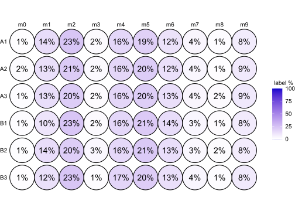

<!-- README.md is generated from README.Rmd. Please edit that file -->

# c13ms

<!-- badges: start -->
<!-- badges: end -->

Analysis of isotope-labelled metabolomics data

## Introduction

``` r
C13 <- exampleTracerExperiment(nsamples = 6, nmets = 5)

colnames(C13)
metnames(C13)
rownames(C13)

colData(C13)
C13$group

C13 %>% subset(group == "A")
C13groups <- split(C13, by = ~ group)
C13 <- with(C13groups, A + B)

metData(C13)
isoData(C13)

assay(C13, "raw")
sumMets(C13, assay = "raw")
```

## Workflow

A typical analysis workflow may look like as demonstrated below:

``` r
C13 %<>% impute(assay = "raw")
C13 %<>% correctIso(assay = "imp")
Natural isotope abundance correction with IsoCorrectoR
https://doi.org/10.1038/s41598-018-36293-4
C13 %<>% normalize(method = ~ COLSUM, assay = "corr")

assay(C13, "mid") <- MID(C13)
assay(C13, "frac", type = "met") <- isoEnrichment(C13)
assay(C13, "norm", type = "met") <- sumMets(C13)

contrasts <- list(groupBvsA = list("group" = c("B", "A")))

C13 %<>% diffTest(contrasts = contrasts, formula = ~ group, type = "met", assay = "norm", method = "ttest")
C13 %<>% diffTest(contrasts = contrasts, formula = ~ group, type = "met", assay = "frac", method = "beta")
C13 %<>% diffTest(contrasts = contrasts, formula = ~ group, type = "iso",  assay = "mid", method = "beta")

results(C13, "iso", "mid", "beta") %>% head(10)
              pval         diff    diff.mean         lfc      padj  padj_all
tckf_m0 0.65195845  0.005488545  0.006471073 -0.23063907 1.0000000 1.0000000
tckf_m1 0.24777611 -0.018914890 -0.015974592 -0.03639141 1.0000000 1.0000000
tckf_m2 0.38518133  0.012006549  0.009503519  0.09391927 1.0000000 1.0000000
il_m0   0.13774189  0.015003779  0.013223614  0.56109072 1.0000000 1.0000000
il_m1   0.01097978  0.027295479  0.022499881  0.32896312 0.3623326 0.3623326
il_m2   0.14395523 -0.021606634 -0.017760468 -0.11601580 1.0000000 1.0000000
il_m3   0.10466884 -0.012620259 -0.010409753 -0.91284594 1.0000000 1.0000000
il_m4   0.35798488 -0.008875287 -0.007553275 -0.05096433 1.0000000 1.0000000
xck_m0  0.10694367 -0.003469224 -0.002906331 -0.39001716 1.0000000 1.0000000
xck_m1  0.24230893 -0.003768474 -0.002985851  0.16436710 1.0000000 1.0000000
```

## Visualization

``` r
isoplot(C13, mets = metnames(C13)[1])
```


