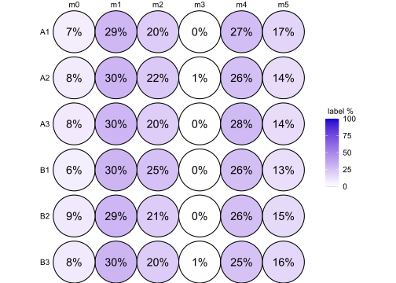

<!-- README.md is generated from README.Rmd. Please edit that file -->

# c13ms

<!-- badges: start -->
<!-- badges: end -->

Analysis of isotope-labelled metabolomics data

## Introduction

``` r
C13 <- exampleTracerExperiment(nsamples = 6, nmets = 5)

colnames(C13)
metnames(C13)
rownames(C13)

colData(C13)
C13$group

C13 %>% subset.TracerExperiment(group == "A")
C13groups <- split.TracerExperiment(C13, by = ~ group)
C13 <- with(C13groups, A + B)

metData(C13)
isoData(C13)

assay(C13, "raw")
```

## Workflow

A typical analysis workflow may look like as demonstrated below:

``` r
C13 %<>% impute(assay = "raw")
C13 %<>% correctIso()
C13 %<>% normalize(method = ~ COLSUM)
Normalization using normCOLSUM 

assay(C13, "mid") <- MID(C13)
assay(C13, "frac", type = "met") <- isoEnrichment(C13)
assay(C13, "norm", type = "met") <- sumMets(C13)

contrasts <- list(groupBvsA = list("group" = c("B", "A")))

C13 %<>% diffTest(contrasts = contrasts, formula = ~ group, type = "met", method = "limma", assay = "norm")
C13 %<>% diffTest(contrasts = contrasts, formula = ~ group, type = "met", method = "beta", assay = "frac")
C13 %<>% diffTest(contrasts = contrasts, formula = ~ group, type = "iso", method = "beta", assay = "mid")

results(C13, "iso")$beta$groupBvsA %>% head(10)
             pval          diff     diff.mean          lfc      padj  padj_all
px_m0 0.630368674 -0.0027860118 -0.0021105230          NaN 1.0000000 1.0000000
px_m1 0.957132333 -0.0003542332 -0.0002350762 -0.005849624 1.0000000 1.0000000
px_m2 0.246364374 -0.0138197302 -0.0113483127 -0.169089034 1.0000000 1.0000000
px_m3 0.380089787  0.0144526177  0.0112631208  0.137676947 1.0000000 1.0000000
px_m4 0.581177532  0.0070210115  0.0061646972  0.101597502 1.0000000 1.0000000
px_m5 0.612258505 -0.0042603922 -0.0037339060 -0.042915285 1.0000000 1.0000000
bu_m0 0.732354338 -0.0023970466 -0.0014748034  0.089204932 1.0000000 1.0000000
bu_m1 0.082233431  0.0270033117  0.0228890818  0.154138964 1.0000000 1.0000000
bu_m2 0.008371333 -0.0062167291 -0.0061709099 -1.347592829 0.2678826 0.2678826
bu_m3 0.771454893  0.0011751634  0.0006223577 -0.020244870 1.0000000 1.0000000
```

## Visualization

``` r
isoplot(C13, mets = metnames(C13)[1])
```


